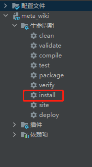

# Meta Wiki —— 知识库系统
  


可以在云端存储电子书、文档的知识库 Wiki 系统，一个由 **Spring Boot** + **Vue3** 搭建的全栈项目：

+ 前端 Vue CLI  项目搭建
+ 后端 Spring Boot 搭建

+ 访问网站：http://www.qingfeng.life/


## 启动方式

需要分别启动前端和后端

+ 后端启动方式：

  + 使用 IDEA 打开后，安装 **lombok** 插件
  + 启动 Redis
  + 启动 RocketMQ
  + 以 Maven 方式运行该 Spring Boot 项目

  后端运行接口
  + 访问http://localhost:8880/test/list
  + [
  +  {"id":1,"name":"test","password":"test"},
  +  {"id":2,"name":"admin","password":"admin"}
  + ]


+ 前端启动方式：

  + 在 /web 子目录下，运行一下命令：

  ```bash
  $ 安装cnpm
  $ npm install -g cnpm --registry=https://registry.npm.taobao.org
  
  $ cnpm -- install
  ...
  $ cnpm run serve-dev
  ...

  ```

## 界面设计


+ 用户管理
+ 电子书管理
+ 文档管理
+ 分类管理
+ 富文本框的集成
+ 图形统计报表展示
+ ....

## 关键技术点

+ **axios** 解决前后端分离架构的通信问题
+ **AOP** 日志记录
+ **RocketMQ、WebSocket** 异步化实现消息通知
+ **ECharts** 用于数据统计展示
+ 定时任务设计
+ **Redis** 存储用户 token 和登陆校验
+ 多环境配置文件分别用于开发和生产
+ **统一异常处理**
+ **拦截器**、**过滤器**
+ ......


+ 打包部署

  + 前端选择serve-prod

  + 后端选择install

  